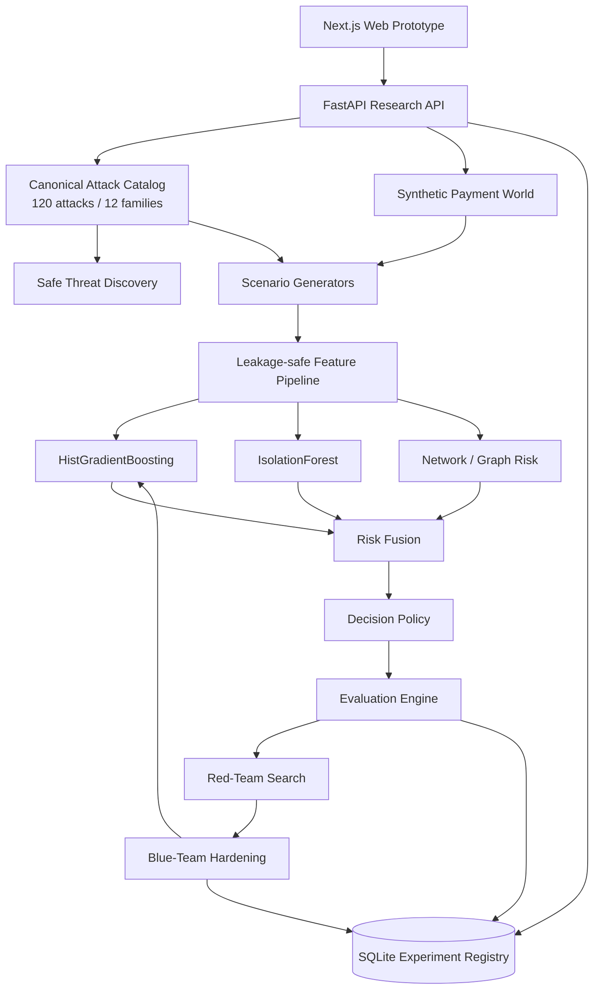

# MasterShield

## AI Defense Lab for Payment Security

MasterShield is a defensive AI payment-security research platform for the Mastercard Innovation Challenge @ GFF 2026. It implements the challenge as a closed loop:

```text
IDENTIFY → GENERATE → DEFEND → EVALUATE → ADAPT
                         ↑                 ↓
                         └── HARDER ATTACKS
```

The web prototype is the interactive research/SOC interface. The Python backend is the canonical source for attack intelligence, synthetic payment simulation, feature engineering, machine-learning detection, evaluation and adversarial hardening.

> **Safety:** all entities, transactions and attack scenarios are synthetic defensive research data. The system does not execute real payment attacks, collect credentials, contact victims, interact with banks/merchants, or create operational phishing/deepfake infrastructure.

---

## What is implemented

| Pillar | Implementation |
|---|---|
| **Identify** | 120 structured synthetic defensive attack scenarios across 12 families plus safe composite-threat discovery |
| **Generate** | Seeded synthetic customers, accounts, merchants, devices, beneficiaries and transaction histories across multiple payment rails |
| **Defend** | Detector v4.3: supervised classifier + anomaly detector + network/graph risk fusion |
| **Evaluate** | Precision, Recall, F1, ROC-AUC, PR-AUC, FPR/FNR, confusion matrix, threshold sweeps, group and unseen-family evaluation |
| **Adapt** | Red-team search for low-risk fraud variants, bounded mutation and iterative detector hardening on an untouched test set |

### Canonical attack catalog

`data/attacks/attacks.json` is the single operational source of truth.

It contains exactly **120 scenarios across 12 families**, with 10 scenarios per family:

1. identity-kyc
2. social-engineering
3. account-takeover
4. merchant-commerce
5. transaction-evasion
6. mule-aml
7. payment-instrument
8. api-digital
9. behavioral-device
10. cross-channel
11. agentic-fraud
12. synthetic-content

Attack records contain stable IDs, severity, difficulty, payment rails, AI capability metadata, observable signals, defense mappings, novelty and generator mapping.

---

## End-to-end architecture



For module responsibilities and the full data/control flow see [`docs/ARCHITECTURE.md`](docs/ARCHITECTURE.md).

---

## Synthetic generation

MasterShield generates a complete synthetic payment world rather than only producing isolated fraud rows.

Entities include:

- customers
- accounts
- merchants
- devices
- beneficiaries
- transaction histories

Modeled payment rails include UPI, cards, wallets, IMPS, NEFT, RTGS, BNPL and cross-border activity.

Generated transactions retain ground-truth and attack metadata for evaluation, while the model feature pipeline removes those label-bearing fields before training or inference.

The generator derives behavioral, transaction, identity/device, contextual and network signals from the synthetic history. A fixed seed produces reproducible output.

---

## Detection architecture

Detector version: **4.3**

```text
Synthetic transaction telemetry
              ↓
      Feature extraction
              ↓
 ┌────────────┬─────────────┬──────────────┐
 │ supervised │ anomaly     │ graph risk   │
 │ classifier │ detector    │              │
 └────────────┴─────────────┴──────────────┘
              ↓
         Risk fusion
              ↓
       Decision threshold
              ↓
  ALLOW / MONITOR / STEP_UP / BLOCK_REVIEW
```

The fused risk score is:

```text
risk = 0.68 * supervised_probability
     + 0.17 * anomaly_score
     + 0.15 * graph_signal
```

The detector rejects feature matrices containing ground-truth or attack metadata such as `ground_truth`, `attack_id`, `attack_family`, `scenario_id`, `scenario_stage` and related fields.

The saved model also records its feature schema and refuses stale or incompatible artifacts.

---

## Evaluation methodology

MasterShield evaluates more than one aggregate score.

Metrics include:

- Precision
- Recall
- F1
- ROC-AUC
- PR-AUC
- False-positive rate
- False-negative rate
- TP/TN/FP/FN

Results can be grouped by attack, family, difficulty and payment rail.

### Unseen-family evaluation

The unseen-family experiment withholds complete attack families from training and evaluates them separately under challenging synthetic conditions. The latest recorded leakage-safe run produced an **F1 of approximately 0.975** on the held-out synthetic families.

### Standard synthetic benchmark

The standard controlled distribution can be highly separable. Near-perfect scores on that benchmark are treated as a **synthetic-distribution diagnostic**, not as production fraud performance.

The final competition narrative should therefore emphasize held-out-family generalization and adversarial robustness, while reporting the standard benchmark with its synthetic-data limitation explicitly stated.

---

## Adaptive red-team / blue-team loop

The hardening experiment keeps an outer split:

```text
60% TRAINING
20% RED-TEAM SEARCH
20% UNTOUCHED TEST
```

The training population receives an additional internal calibration split used only to select an operating threshold subject to a false-positive-rate constraint.

Each hardening round:

1. fit a detector on training data;
2. search synthetic fraud mutations for low-risk cases;
3. add selected hard cases to training;
4. recalibrate the threshold using training-only data;
5. refit the detector;
6. evaluate only on the untouched test population.

This is a defensive robustness experiment over synthetic telemetry. It does not interact with live payment systems.

---

## Repository structure

```text
MasterShield/
├── app/                         # Next.js routes
│   ├── attack-library/
│   ├── simulator/
│   ├── generated-data/
│   ├── detection-lab/
│   ├── investigation/
│   ├── closed-loop/
│   ├── novelty-engine/
│   └── demo/
├── components/                  # Frontend UI
├── lib/api/                     # FastAPI client boundary
├── types/                       # Frontend domain types
├── backend/
│   ├── app/
│   │   ├── identify/
│   │   ├── simulation/
│   │   ├── generators/
│   │   ├── features/
│   │   ├── detection/
│   │   ├── evaluation/
│   │   ├── adversarial/
│   │   ├── storage/
│   │   └── api/
│   └── tests/
├── data/
│   └── attacks/
│       └── attacks.json         # canonical 120-scenario catalog
├── scripts/                     # reproducible experiments
├── docs/                        # architecture/methodology/API docs
├── render.yaml                  # optional deployment config
└── README.md
```

---

## Quick start

### Backend

```bash
python -m venv .venv

# Windows PowerShell
.venv\\Scripts\\Activate.ps1

# macOS/Linux
source .venv/bin/activate

pip install -r backend/requirements.txt
```

Validate the catalog:

```bash
PYTHONPATH=. python scripts/validate_catalog.py
```

Run the full experiment pipeline:

```bash
PYTHONPATH=. python scripts/run_all.py
```

Start FastAPI:

```bash
PYTHONPATH=. uvicorn backend.app.main:app --reload --port 8000
```

Open:

```text
http://localhost:8000/docs
```

### Frontend

Create `.env.local`:

```text
NEXT_PUBLIC_API_URL=http://localhost:8000
```

Then:

```bash
npm ci
npm run dev
```

Open:

```text
http://localhost:3000
```

---

## Reproducible experiments

Generate synthetic data:

```bash
PYTHONPATH=. python scripts/generate_data.py \
  --events 10000 \
  --seed 829134 \
  --difficulty very-high \
  --adaptation adversarial \
  --noise medium
```

Train:

```bash
PYTHONPATH=. python scripts/train_model.py
```

Evaluate:

```bash
PYTHONPATH=. python scripts/evaluate_model.py
PYTHONPATH=. python scripts/evaluate_unseen.py
PYTHONPATH=. python scripts/benchmark.py
PYTHONPATH=. python scripts/run_closed_loop.py
```

Or run the complete sequence:

```bash
PYTHONPATH=. python scripts/run_all.py
```

Generated model/data artifacts are local outputs and are ignored by git.

For the detailed experiment protocol see [`docs/MODEL_AND_EVALUATION.md`](docs/MODEL_AND_EVALUATION.md) and [`docs/REPRODUCIBILITY.md`](docs/REPRODUCIBILITY.md).

---

## API surface

```text
GET  /health
GET  /api/catalog/summary
GET  /api/catalog/discover
GET  /api/attacks
GET  /api/attacks/{attack_id}

POST /api/simulate
GET  /api/simulations/{simulation_id}
GET  /api/simulations/{simulation_id}/events
GET  /api/simulations/{simulation_id}/results
GET  /api/simulations/{simulation_id}/rounds

POST /api/detect
POST /api/predict
GET  /api/experiments/{experiment_id}
GET  /api/models/current

GET  /api/transactions/{transaction_id}
GET  /api/transactions/{transaction_id}/assessment

POST /api/adversarial/search
POST /api/adversarial/harden
```

See [`docs/API.md`](docs/API.md) for request/response contracts.

---

## Web prototype flow

```text
Attack Library
      ↓
Attack Detail
      ↓
Red Team Simulator
      ↓
Generated Data
      ↓
Detection Lab
      ↓
Investigation
      ↓
Closed Loop
      ↓
Novelty Engine
      ↓
Judge Demo
```

The Judge Demo presents a guided version of:

`IDENTIFY → GENERATE → DEFEND → EVALUATE → ADAPT`

---

## Documentation map

- [`docs/ARCHITECTURE.md`](docs/ARCHITECTURE.md) — system architecture and component responsibilities
- [`docs/API.md`](docs/API.md) — API routes and data contracts
- [`docs/MODEL_AND_EVALUATION.md`](docs/MODEL_AND_EVALUATION.md) — detector, leakage controls and evaluation methodology
- [`docs/REPRODUCIBILITY.md`](docs/REPRODUCIBILITY.md) — environment and experiment commands
- [`docs/CHALLENGE_MAPPING.md`](docs/CHALLENGE_MAPPING.md) — mapping from competition requirements to implementation
- [`docs/SUBMISSION_CHECKLIST.md`](docs/SUBMISSION_CHECKLIST.md) — final submission checklist

---

## Production boundary

This is a hackathon/research prototype. A production payment-security deployment would additionally require authenticated access, secrets management, managed storage, privacy/data governance, model governance, high availability, audit logging, rate limiting and organization-specific fraud calibration.
