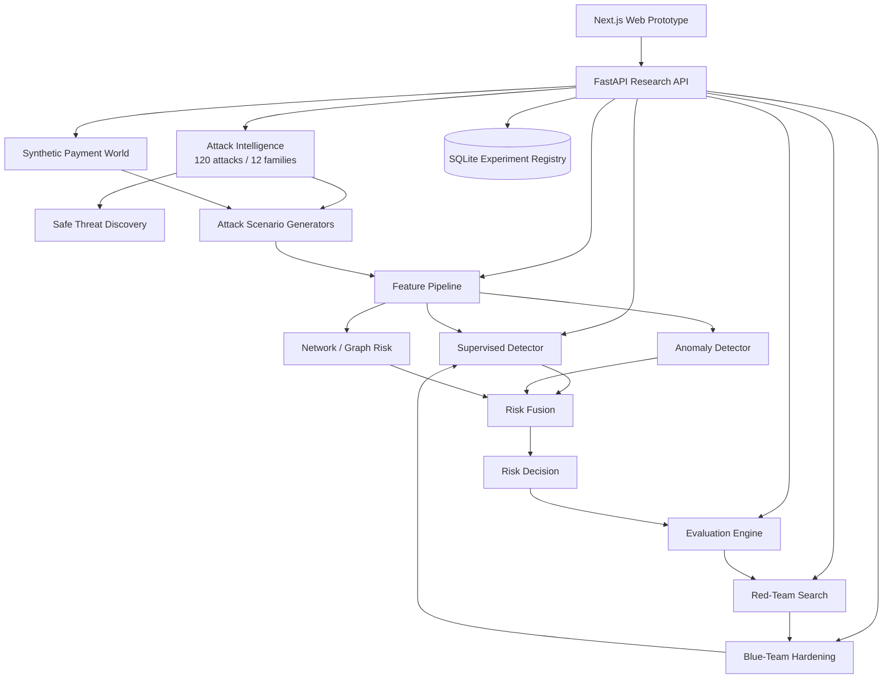

# MasterShield

## AI Defense Lab for Payment Security

MasterShield is a defensive AI payment-security research platform for the Mastercard Innovation Challenge @ GFF 2026. It implements the challenge as a closed-loop laboratory rather than as a static fraud classifier:

```text
IDENTIFY → GENERATE → DEFEND → EVALUATE → ADAPT
                         ↑                 ↓
                         └── HARDER ATTACKS
```

The web prototype provides the interactive security-operations interface. The Python backend provides the canonical attack catalog, synthetic payment simulation, machine-learning detector, evaluation framework and adversarial hardening engine.

> **Safety:** MasterShield is a synthetic defensive research environment. It does not execute real payment attacks, collect credentials, contact victims, interact with banks or merchants, or create operational phishing/deepfake infrastructure.

---

## What the repository contains

| Layer | Purpose | Main location |
|---|---|---|
| Web prototype | Interactive research/SOC interface | `app/`, `components/` |
| API client | Frontend/backend contract | `lib/api/` |
| Attack intelligence | 120 attack definitions and discovery | `data/attacks/`, `backend/app/identify/` |
| Synthetic world | Accounts, merchants, devices, beneficiaries | `backend/app/simulation/` |
| Attack generation | Family-specific and multi-stage simulation | `backend/app/generators/` |
| Features | Transaction, behavioral, identity, context, network | `backend/app/features/` |
| Detection | Supervised + anomaly + graph risk | `backend/app/detection/` |
| Evaluation | Metrics, thresholds, grouped benchmarks | `backend/app/evaluation/` |
| Adversarial loop | Hard-variant search and hardening | `backend/app/adversarial/` |
| Storage | Experiment metadata | `backend/app/storage/` |
| Reproducibility | CLI experiments and validation | `scripts/` |
| Documentation | Architecture and methodology | `docs/` |

---

## Challenge coverage

### 1. Identify

The canonical catalog currently contains **120 structured synthetic defensive research attack definitions across 12 attack families**. Each definition includes:

- stable attack ID
- attack family
- safe scenario description
- severity
- detection difficulty
- payment-rail coverage
- AI-capability metadata
- observable signals
- defense mappings
- novelty score
- evidence status
- generator mapping

The catalog is validated by automated tests and by `scripts/validate_catalog.py`.

The Identify layer also contains a safe composite-threat discovery mechanism. It recombines existing threat attributes into non-operational hypotheses for further simulation and defensive research.

### 2. Generate

MasterShield creates a deterministic synthetic payment world containing:

- customers
- accounts
- merchants
- devices
- beneficiaries
- transaction histories
- cross-channel scenarios
- synthetic network relationships

The transaction generator models these payment rails:

- UPI
- CARD
- WALLET
- IMPS
- NEFT
- RTGS
- BNPL
- CROSS_BORDER

Generated events contain ground-truth labels and contextual telemetry. One-hour and 24-hour velocities are derived from prior events, account baselines drive amount/behavioral deviation, and network signals are derived from relationships visible up to the event.

Attack definitions map to reusable generator families, so 120 catalog entries can create large populations of synthetic attack instances without hard-coding millions of records.

### 3. Defend

The current detector combines:

1. `HistGradientBoostingClassifier` supervised fraud probability
2. `IsolationForest` behavioral anomaly score
3. synthetic causal network/graph risk

The current detector version is `4.2`.

The fused score is:

```text
risk = 0.68 * supervised_probability
     + 0.17 * anomaly_score
     + 0.15 * graph_signal
```

The score is bounded to `[0, 1]` and mapped to:

```text
ALLOW
MONITOR
STEP_UP
BLOCK_REVIEW
```

The detector also returns feature-based explanations for transaction investigation.

### 4. Evaluate

The evaluation framework reports:

- Precision
- Recall
- F1
- ROC-AUC
- PR-AUC
- False-positive rate
- False-negative rate
- TP/TN/FP/FN
- threshold sweeps
- operating-threshold selection
- performance by attack
- performance by family
- performance by payment rail
- performance by difficulty
- inference latency

### 5. Adapt

The red team searches the **synthetic feature space** for fraud variants that receive low detector risk. Hard examples are fed back into detector training.

The hardening implementation keeps these populations separate:

```text
TRAINING DATA
     │
     ├──────────────► RED-TEAM SEARCH / AUGMENTATION
     │
     └──────────────► UNTOUCHED FINAL TEST
```

This prevents the hardening experiment from simply evaluating on examples that were used to search or train the model.

---

## End-to-end architecture



For the detailed architecture and module responsibilities, see [`docs/ARCHITECTURE.md`](docs/ARCHITECTURE.md).

---

## Repository structure

```text
MasterShield/
│
├── app/                         # Next.js App Router pages
│   ├── attack-library/          # Attack intelligence UI
│   ├── simulator/               # Red-team simulator UI
│   ├── generated-data/          # Synthetic event workspace
│   ├── detection-lab/           # Model/evaluation UI
│   ├── investigation/           # Transaction explanation UI
│   ├── closed-loop/             # Adversarial hardening UI
│   ├── novelty-engine/          # Threat discovery UI
│   └── demo/                    # Guided judge walkthrough
│
├── components/                  # Reusable frontend components
├── lib/api/                     # Typed FastAPI client
├── types/                       # Frontend domain types
│
├── backend/
│   ├── app/
│   │   ├── api/                 # FastAPI route layer
│   │   ├── identify/            # Catalog + discovery
│   │   ├── simulation/          # Synthetic entity world
│   │   ├── generators/          # Scenario generation
│   │   ├── features/            # Model features + graph signals
│   │   ├── detection/           # Detector + serving + explanations
│   │   ├── evaluation/          # Metrics and grouping
│   │   ├── adversarial/         # Red-team search + hardening
│   │   ├── storage/             # SQLite metadata store
│   │   └── schemas.py            # API/domain validation
│   └── tests/                   # Backend tests
│
├── data/
│   └── attacks/
│       └── attacks.json         # Canonical attack catalog
│
├── scripts/                     # Reproducible experiments
├── ml/                           # Local model/result artifacts
├── docs/                         # Architecture and methodology
│   ├── ARCHITECTURE.md
│   ├── CHALLENGE_MAPPING.md
│   ├── MODEL_AND_EVALUATION.md
│   └── REPRODUCIBILITY.md
│
├── docker-compose.yml
├── render.yaml
└── README.md
```

---

## Quick start

### Prerequisites

- Python 3.12 recommended
- Node.js compatible with the repository's Next.js version
- Git

### Backend

```bash
python -m venv .venv

# macOS/Linux
source .venv/bin/activate

# Windows PowerShell
.venv\Scripts\Activate.ps1

pip install -r backend/requirements.txt
```

Validate the catalog:

```bash
python scripts/validate_catalog.py
```

Run the backend experiment pipeline:

```bash
python scripts/run_all.py
```

Start the API:

```bash
uvicorn backend.app.main:app --reload --port 8000
```

Open the API documentation at:

```text
http://localhost:8000/docs
```

### Frontend

Create `.env.local`:

```text
NEXT_PUBLIC_API_URL=http://localhost:8000
```

Then:

```bash
npm ci
npm run dev
```

Open:

```text
http://localhost:3000
```

The frontend's operational API boundary is `lib/api/`. It requests attack data and simulation/detection results from FastAPI rather than treating the old local TypeScript simulation data as the source of truth.

---

## Reproducible experiments

### Generate synthetic data

```bash
python scripts/generate_data.py \
  --events 10000 \
  --seed 829134 \
  --difficulty very-high \
  --adaptation adversarial \
  --noise medium
```

### Train the detector

```bash
python scripts/train_model.py
```

Training writes local artifacts such as `ml/models/detector.joblib`, model metadata and feature schema. These generated files are intentionally ignored by git.

### Standard evaluation

```bash
python scripts/evaluate_model.py
```

### Unseen-family evaluation

```bash
python scripts/evaluate_unseen.py
```

This withholds complete attack families from training instead of performing only a random row split.

### Difficulty benchmark

```bash
python scripts/benchmark.py
```

### Closed-loop adversarial experiment

```bash
python scripts/run_closed_loop.py
```

### Run everything

```bash
python scripts/run_all.py
```

For the full methodology, see [`docs/REPRODUCIBILITY.md`](docs/REPRODUCIBILITY.md) and [`docs/MODEL_AND_EVALUATION.md`](docs/MODEL_AND_EVALUATION.md).

---

## API reference

The FastAPI service exposes:

### Health and catalog

```text
GET  /health
GET  /api/catalog/summary
GET  /api/catalog/discover
GET  /api/attacks
GET  /api/attacks/{attack_id}
```

### Simulation

```text
POST /api/simulate
GET  /api/simulations/{simulation_id}
GET  /api/simulations/{simulation_id}/events
GET  /api/simulations/{simulation_id}/results
GET  /api/simulations/{simulation_id}/rounds
```

### Detection and experiments

```text
POST /api/detect
POST /api/predict
GET  /api/experiments/{experiment_id}
GET  /api/models/current
```

### Investigation

```text
GET /api/transactions/{transaction_id}
GET /api/transactions/{transaction_id}/assessment
```

### Adversarial loop

```text
POST /api/adversarial/search
POST /api/adversarial/harden
```

The schemas in `backend/app/schemas.py` validate simulation, detection and prediction requests.

---

## Web prototype flow

The frontend presents the system in this order:

```text
Attack Library
      ↓
Select / inspect attack
      ↓
Red Team Simulator
      ↓
Generate synthetic events
      ↓
Generated Data
      ↓
Detection Lab
      ↓
Investigation
      ↓
Closed Loop
      ↓
Novelty Engine
```

The dedicated Judge Demo presents the challenge story in a shorter guided sequence.

---

## Synthetic data model

### Entities

The simulator creates synthetic records for:

- customers
- accounts
- merchants
- devices
- beneficiaries

### Transaction telemetry

Representative generated fields include:

- transaction ID
- timestamp
- account/customer IDs
- merchant/beneficiary/device IDs
- amount
- payment rail
- account age
- baseline daily volume
- beneficiary age
- device trust
- merchant risk
- one-hour and 24-hour velocity
- geographic deviation
- behavioral deviation
- identity consistency
- urgency/context fields
- scenario and stage metadata
- ground-truth fraud label
- attack ID/family metadata

### Network telemetry

The feature layer derives causal relationship signals such as:

- device account reuse
- account/beneficiary degree
- beneficiary fan-out
- account outflow
- beneficiary inflow
- counterparty count
- network concentration
- composite graph risk

---

## Attack generator design

MasterShield does not implement one hand-written generator for every catalog entry. Instead:

```text
120+ attack definitions
       ↓
~generator families
       ↓
parameterized synthetic scenarios
       ↓
large populations of attack instances
```

Attack definitions influence the generator through:

- generator family
- observable signals
- novelty
- severity
- difficulty
- rail coverage
- AI capability metadata

This provides scale while keeping the simulation engine maintainable.

---

## Detection design

The current detector is deliberately transparent and modular.

```text
Raw synthetic events
        ↓
Feature extraction
        ↓
 ┌─────────────┬──────────────┬─────────────┐
 │ Supervised  │ Behavioral   │ Network     │
 │ classifier  │ anomaly      │ graph risk  │
 └─────────────┴──────────────┴─────────────┘
        ↓
Risk fusion
        ↓
Decision policy
        ↓
Explanation
```

The model uses feature-based attribution for transaction explanations. The project does not claim that these explanations are full SHAP values.

---

## Evaluation methodology

A strong result in MasterShield is not defined only by an aggregate F1 score.

We evaluate by:

- attack
- family
- difficulty
- payment rail
- threshold
- known vs unseen attack families
- static vs adaptive/adversarial conditions

The repository also measures inference latency, but latency numbers should always be interpreted as local prototype measurements, not a production payment SLA.

---

## Adversarial hardening methodology

The closed loop is a defensive robustness experiment over synthetic telemetry:

```text
1. Train baseline detector
2. Hold a red-team search population aside
3. Keep an untouched final test population
4. Generate bounded synthetic fraud mutations
5. Score mutations with the detector
6. Select difficult low-risk fraud variants
7. Add selected variants to training
8. Retrain detector
9. Re-evaluate on untouched test data
10. Repeat for multiple rounds
```

The objective is to expose weaknesses in the synthetic detector and quantify how the detector changes after hard-case augmentation.

---

## Safety and research boundary

MasterShield uses simulated payment entities and events only.

It does not:

- perform real transfers
- interact with financial institutions
- collect or test real credentials
- contact victims
- generate operational phishing campaigns
- deploy deepfakes
- exploit third-party systems
- access private payment data

GenAI-powered fraud is represented at the level of threat concepts and observable telemetry needed to evaluate defenses.

---

## Production-readiness boundary

This project is a hackathon/research prototype, not a production payment-fraud service.

A production deployment would additionally require:

- authenticated and authorized API access
- secrets management
- managed durable storage
- privacy and data-governance controls
- model governance and monitoring
- high-availability inference
- distributed workload management for very large simulations
- audit logging
- rate limiting
- service-level monitoring
- organization-specific fraud data and calibration

The challenge submission should present these as next-step engineering requirements rather than implying they are already implemented.

---

## Documentation map

- [`docs/ARCHITECTURE.md`](docs/ARCHITECTURE.md) — system architecture and module responsibilities
- [`docs/CHALLENGE_MAPPING.md`](docs/CHALLENGE_MAPPING.md) — exact mapping from challenge criteria to implementation
- [`docs/MODEL_AND_EVALUATION.md`](docs/MODEL_AND_EVALUATION.md) — detector and evaluation methodology
- [`docs/REPRODUCIBILITY.md`](docs/REPRODUCIBILITY.md) — setup, experiments and reproducibility
- [`DEPLOYMENT.md`](DEPLOYMENT.md) — optional deployment instructions

---

## Project status

The repository contains the integrated Next.js frontend and FastAPI research backend. PR #2, which connected the frontend to the backend, has been merged into `main`.

The immediate submission workflow is now:

```text
Validate repository
      ↓
Regenerate benchmark artifacts
      ↓
Record measured results
      ↓
Complete solution walkthrough
      ↓
Submit GitHub repository + write-up + working prototype
```

## License

See [`LICENSE`](LICENSE).
