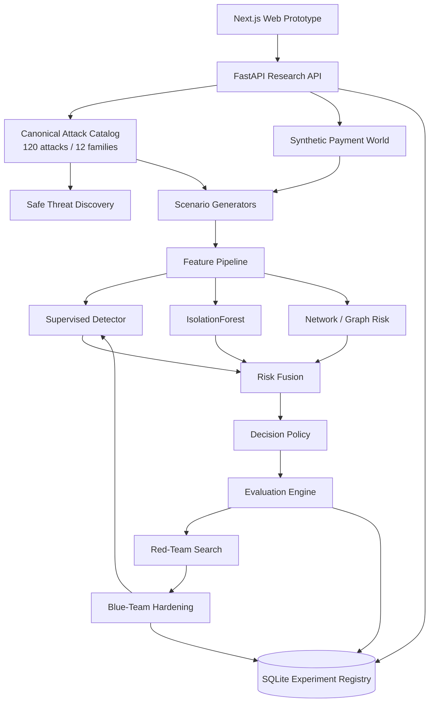

# MasterShield Architecture

## 1. Purpose

MasterShield is an end-to-end synthetic payment-fraud defense laboratory implementing:

`IDENTIFY → GENERATE → DEFEND → EVALUATE → ADAPT`

The system is designed to stress-test fraud defenses against GenAI-enabled payment-fraud scenarios without interacting with real payment systems.

## 2. System boundary



## 3. Canonical attack intelligence

`data/attacks/attacks.json` is the single source of truth for the 120 synthetic defensive research scenarios. The backend validates IDs, family, severity, difficulty, rails, observable signals, defense mappings and generator IDs before serving them to the application.

The integrated frontend obtains attack records through `lib/api/` and FastAPI rather than maintaining a second operational attack catalog.

## 4. Identify layer

`backend/app/identify/` loads the canonical catalog and provides safe composite-threat discovery. Discovery recombines existing threat attributes into non-operational hypotheses for simulation and defensive research.

## 5. Generate layer

`backend/app/simulation/` creates synthetic customers, accounts, merchants, devices, beneficiaries and transaction history.

`backend/app/generators/` maps attack definitions onto reusable generator families and injects attack-specific behavioral, transactional, contextual and network signals.

Generation is seeded for reproducibility and retains ground-truth/attack metadata for evaluation only.

## 6. Feature layer

`backend/app/features/pipeline.py` derives transaction, behavioral, identity/device, contextual and network signals.

Ground-truth and attack metadata are explicitly excluded from the model feature matrix, including:

- `ground_truth`
- `attack_id`
- `attack_family`
- `attack_difficulty`
- `attack_novelty`
- `attack_severity`
- `attack_name`
- `scenario_id`
- `scenario_stage`
- `multi_stage_scenario`

## 7. Detection layer

`backend/app/detection/model.py` combines:

- `HistGradientBoostingClassifier`
- `IsolationForest`
- synthetic graph risk

The current detector version is **4.3**.

```text
risk = 0.68 * supervised_probability
     + 0.17 * anomaly_score
     + 0.15 * graph_signal
```

Risk is bounded to `[0, 1]` and mapped to configurable operational decisions.

The model stores its feature schema, anomaly calibration and feature importance. Loading rejects stale or metadata-leaking artifacts and refreshes the model when required.

## 8. Evaluation layer

The repository evaluates by:

- attack
- family
- difficulty
- payment rail
- threshold
- unseen family
- adversarial condition

Metrics include precision, recall, F1, ROC-AUC, PR-AUC, false-positive rate, false-negative rate and confusion-matrix counts.

The standard synthetic evaluation is treated as a **distribution/separation diagnostic**, not as evidence of production fraud performance.

The primary generalization evidence is the held-out-family experiment, while the closed-loop experiment measures robustness under red-team search and hard-case augmentation.

## 9. Adaptive hardening

The hardening workflow maintains an outer split:

```text
60% TRAINING
20% RED-TEAM SEARCH
20% UNTOUCHED TEST
```

An internal calibration split is taken from the training population to select an operating threshold subject to a false-positive-rate constraint. The final model is refit on the current training population, while the untouched test set remains isolated.

Each round:

1. score synthetic fraud candidates;
2. search bounded mutations for low-risk cases;
3. augment training with selected hard cases;
4. recalibrate the operating threshold using training-only data;
5. refit the detector;
6. score the untouched test set.

This avoids selecting the test threshold from the final test population.

## 10. Frontend boundary

The Next.js application uses `lib/api/` as the operational client boundary. `NEXT_PUBLIC_API_URL` selects the backend.

No second client-side attack catalog or simulation engine is required for the integrated application; the canonical backend catalog and simulation/detection APIs are the operational source of truth.

## 11. Storage

The SQLite registry stores simulation, experiment and closed-loop metadata. Generated datasets and model artifacts are local reproducibility outputs and are ignored by git.

## 12. Reproducibility

The default experiment seed is `829134`. Key experiment commands are documented in the root README and `docs/REPRODUCIBILITY.md`.

The model metadata records version, seed, training/validation sizes, operating threshold, feature schema and feature importance.

## 13. Safety boundary

All transactions, identities, accounts, devices and attack scenarios are synthetic. The platform does not execute payment attacks, contact victims, collect credentials or interact with live financial systems.
