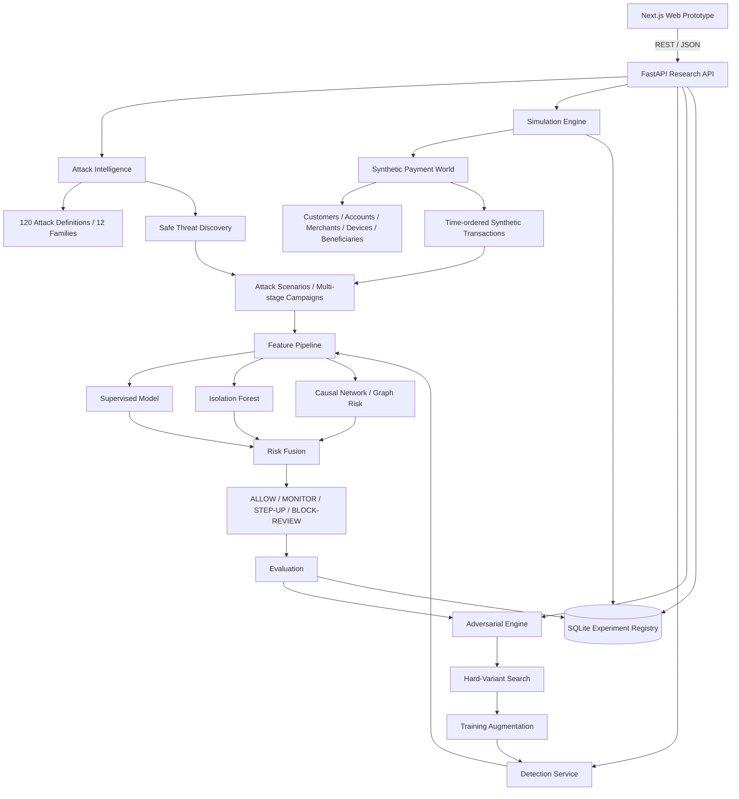

# MasterShield Architecture

## 1. Purpose

MasterShield is a defensive payment-security research laboratory implementing the challenge loop:

`IDENTIFY -> GENERATE -> DEFEND -> EVALUATE -> ADAPT`

The repository deliberately separates threat intelligence, synthetic data generation, machine-learning detection, evaluation, adversarial robustness testing, API serving, and the web interface.

## 2. System overview



## 3. Repository boundaries

```text
app/                       Next.js routes and UI entrypoints
components/                Reusable frontend UI
lib/api/                   Typed client for the FastAPI backend
types/                     Frontend domain types

backend/app/api/           HTTP contract and request/response handling
backend/app/identify/      Attack catalog, evidence metadata, safe discovery
backend/app/simulation/    Synthetic financial-world entities and state
backend/app/generators/    Attack-aware scenario and transaction generation
backend/app/features/      Model features, behavioral features, graph signals
backend/app/detection/     Model training, inference, fusion and explanations
backend/app/evaluation/    Metrics, threshold sweeps and grouped evaluation
backend/app/adversarial/  Defensive mutation, hard-variant search and hardening
backend/app/storage/      SQLite experiment registry
backend/tests/             Backend tests

data/attacks/             Canonical attack catalog
scripts/                   Reproducible training/evaluation/benchmark commands
ml/models/                 Locally generated model artifacts (ignored by git)
ml/results/                Locally generated experiment outputs (ignored by git)
```

## 4. Identify layer

The canonical source is `data/attacks/attacks.json`. The backend validates each entry using Pydantic and exposes the catalog through `/api/attacks` and `/api/catalog/summary`.

Each attack contains:

- stable attack ID
- family
- safe description
- severity
- difficulty
- payment rails
- AI capability metadata
- observable detection signals
- defense mappings
- novelty score
- evidence status
- generator ID

The `generator_id` is the bridge from research taxonomy to executable synthetic simulation logic.

The repository currently contains 120 attack definitions spanning 12 families. Catalog tests enforce a minimum of 120 unique structured entries.

## 5. Generate layer

### 5.1 Synthetic payment world

`backend/app/simulation/entities.py` creates deterministic synthetic entities:

- customers
- accounts
- merchants
- devices
- beneficiaries

The world is seeded so experiments are reproducible.

### 5.2 Transaction history

`backend/app/generators/transaction.py` generates time-ordered synthetic transactions across eight modeled rails:

- UPI
- CARD
- WALLET
- IMPS
- NEFT
- RTGS
- BNPL
- CROSS_BORDER

Behavioral quantities such as one-hour and 24-hour velocity are derived from prior events in the synthetic history rather than assigned as arbitrary labels.

### 5.3 Attack scenarios

`backend/app/generators/scenarios.py` maps each catalog attack to a reusable generator family. A generator modifies synthetic telemetry according to the selected attack's signals, family, novelty, severity and difficulty.

Supported families include identity/KYC, social engineering, account takeover, merchant abuse, transaction evasion, AML/mule behavior, payment-instrument abuse, API/digital abuse, behavioral/device evasion, cross-channel scenarios, autonomous/agentic fraud, and synthetic-content scenarios.

### 5.4 Multi-stage campaigns

Cross-channel and autonomous scenarios may share a `scenario_id` and ordered `scenario_stage` values so a payment can be evaluated as part of a broader synthetic campaign rather than as an isolated row.

## 6. Feature layer

`backend/app/features/pipeline.py` converts raw synthetic events into the model matrix.

Feature groups include:

### Transaction

- amount
- amount z-score against the synthetic account baseline
- one-hour and 24-hour velocity
- beneficiary age
- account age
- rail

### Behavioral

- behavioral deviation
- normal daily transaction volume
- geographic distance
- cross-rail activity
- multi-stage scenario indicator

### Identity/device/context

- device trust
- device reuse
- identity consistency
- merchant risk
- urgency
- approval-path change
- content risk

### Network / AML

The graph feature module derives causal relationship signals such as:

- account/beneficiary degree
- device reuse
- beneficiary fan-out
- account outflow
- beneficiary inflow
- counterparty count
- network concentration
- network risk

Network features are computed from transactions available up to the current event to reduce temporal leakage.

## 7. Defend layer

The detector is implemented in `backend/app/detection/model.py`.

### Supervised model

A `HistGradientBoostingClassifier` learns a fraud probability from the feature matrix.

### Behavioral anomaly model

An `IsolationForest` provides an independent anomaly score. Its calibration values are learned from training data and reused at inference time rather than normalized against the incoming batch.

### Graph risk

A bounded graph-risk feature summarizes synthetic relationship risk for account/device/beneficiary networks.

### Risk fusion

The service combines the three components into a bounded risk score:

```text
final risk = 0.68 * supervised
           + 0.17 * anomaly
           + 0.15 * graph
```

These weights are part of the prototype detector and can be changed for experiments.

The decision layer maps risk to:

```text
ALLOW
MONITOR
STEP_UP
BLOCK_REVIEW
```

### Explainability

For each prediction, the detector returns the top contributing model features and a normalized signal-strength interpretation suitable for the Investigation UI.

## 8. Evaluate layer

Evaluation is intentionally more rigorous than one random accuracy number.

The repository computes:

- precision
- recall
- F1
- ROC-AUC
- PR-AUC
- false-positive rate
- false-negative rate
- TP/TN/FP/FN
- threshold sweeps
- operating-threshold selection
- performance by attack
- performance by family
- performance by payment rail
- performance by difficulty
- inference latency

### Unseen-family protocol

`scripts/evaluate_unseen.py` holds out complete attack families from training and evaluates them separately at higher difficulty/adaptation. This is intended to measure generalization to attack families not represented in the training set.

### Difficulty benchmark

`scripts/benchmark.py` evaluates low, medium, high and very-high difficulty conditions and reports per-rail metrics.

## 9. Adapt layer

The red-team robustness loop is implemented under `backend/app/adversarial/`.

### Hard-variant search

The search engine starts from synthetic fraud events and creates bounded feature-space mutations. Candidate variants are scored by the detector; lower-risk fraud variants are retained as harder synthetic cases.

### Hardening protocol

`harden_detector()` separates:

```text
Training population
       |
       +---- Red-team search/augmentation population
       |
       +---- Untouched final test population
```

The detector is retrained with selected hard variants, but the final test population remains untouched throughout the hardening rounds.

This provides a meaningful before/after robustness experiment without evaluating the hardened model on the data used to generate the hard examples.

## 10. API layer

FastAPI is the stable boundary between the frontend and research engine.

Primary routes:

```text
GET  /health
GET  /api/catalog/summary
GET  /api/catalog/discover
GET  /api/attacks
GET  /api/attacks/{attack_id}

POST /api/simulate
GET  /api/simulations/{simulation_id}
GET  /api/simulations/{simulation_id}/events
GET  /api/simulations/{simulation_id}/results
GET  /api/simulations/{simulation_id}/rounds

POST /api/detect
POST /api/predict
GET  /api/experiments/{experiment_id}
GET  /api/models/current

GET  /api/transactions/{transaction_id}
GET  /api/transactions/{transaction_id}/assessment

POST /api/adversarial/search
POST /api/adversarial/harden
```

The API returns JSON-safe values and validates all public request parameters with Pydantic models.

## 11. Experiment persistence

SQLite stores lightweight experiment metadata:

- simulation runs
- metrics
- closed-loop rounds
- model version
- threshold
- seeds and configuration

The actual database is ignored by git; it is regenerated locally.

## 12. Frontend boundary

The Next.js application uses `lib/api/` as the only operational client boundary. `NEXT_PUBLIC_API_URL` selects the backend.

The legacy TypeScript simulation engine is retained as reference code but is not the operational source of truth for the integrated routes.

## 13. Reproducibility

The default backend experiment seed is `829134`. Key experiment commands are documented in the root README and can be executed independently or with `python scripts/run_all.py`.

The model training script records:

- model version
- seed
- training/validation sizes
- operating threshold
- feature list
- feature importance

The evaluation scripts record the seed, model version and dataset configuration with their results.

## 14. Safety boundary

MasterShield is a synthetic defensive security research environment. It does not execute real payment attacks, interact with banks or merchants, collect credentials, contact victims, or generate operational phishing/deepfake infrastructure.

Attack definitions describe threat concepts at a defensive simulation level; generated events are synthetic telemetry used for controlled model evaluation.
